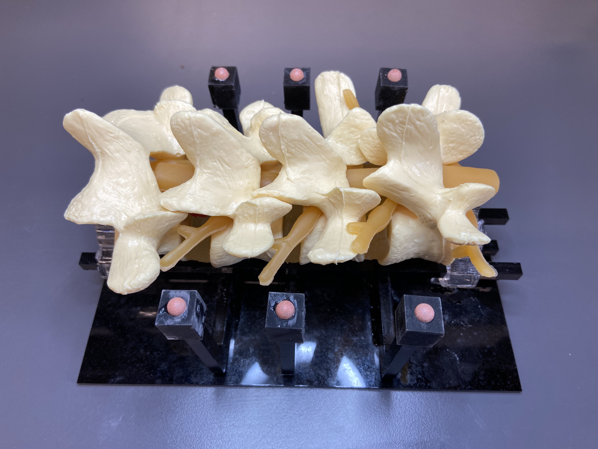
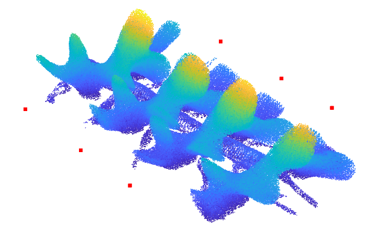
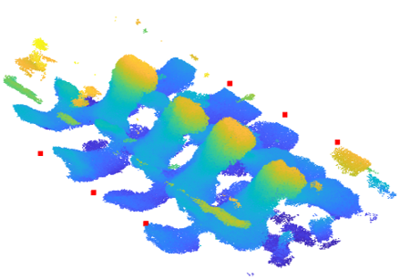
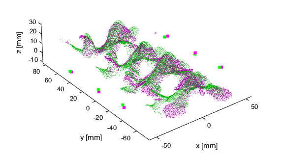

# ISMR24 Multimodal Spine Registration

This repository contains data and code for our paper titled ```Feasibility of Point-cloud based Ultrasound-CT Registration towards Automated, Robot-Assisted Image-Guidance in Spine Surgery```, presented at IEEE ISMR 2024.

## 0. dependencies
- MATLAB (tested on 2022b)
    - ROS Toolbox
    - Lidar Toolbox
    - Medical Imaging Toolbox
    - Statistics and Machine Learning Toolbox
    - Signal Processing Toolbox

## 1. multimodal lumbar spine phantom dataset
We built a lumbar spine phantom for multimodal imaging (CT, Ultrasound). We provide CT DICOM data, as well as 2D ultrasound images with robotic tracking data. In addition, we provide scripts to generate spine pointcloud from CT and ultrasound scan.

### lumbar spine phantom
The phantom was built upon a four-part lumbar spine model (see Fig. below). Six fiducial markers made of ceramic balls (6 mm diameter) are arranged on the two sides of the phantom.



### CT volume data
Download CT DICOM data ```AX_BONE_0005.zip``` from:
https://zenodo.org/records/11455227.
Extract files under ```dataset/2023-10-26_spine_phantom_CT```

### generating pointcloud from spine phantom CT volume
In MATLAB, execute the script ```scripts/generate_pcd_from_ct_phantom.m``` to extract and visualize vetebrae pointcloud with fiducial markers.

Output should look like:



The pointcloud data can be found under ```dataset/2023-10-26_spine_phantom_CT/vertebrae.pcd``` and ```dataset/2023-10-26_spine_phantom_CT/fiducials.pcd```

### robotic ultrasound volume data
Download CT DICOM data ```2023-11-13-15-24-09.bag``` from:
https://zenodo.org/records/11455227
place the bag file under ```dataset/2023-11-13_spine_phantom_franka_US```. The bag file contains ultrasound images and robotic tracking data

### generating pointcloud from spine phantom robotic ultrasound
In MATLAB, execute the script ```scripts/generate_pcd_from_us_phantom.m``` to extract and visualize vetebrae pointcloud with fiducial markers

Results should look like:



The pointcloud data can be found under ```dataset/2023-11-13_spine_phantom_franka_US/vertebrae.pcd``` and ```dataset/2023-11-13_spine_phantom_franka_US/fiducials.pcd```

## 2. point-cloud based ultrasound-CT spine registration pipeline
We provide example scripts which registers CT with 3D Robotic ultrasound data.

### usage
In MATLAB, execute the script ```reg_multimodal_spine/registration_ct_us.m``` to process and register the CT and ultrasound lumbar spine and reproduce results in our paper.

Results using our ```FPFH+CPD``` method should look like:



where green points are from CT, and magenta points are from robotic ultrasound.

## citation
Please consider citing our work if you find this repository useful.
```
@InProceedings{
author="Xihan Ma, Xiao Zhang, Yang Wang, Christopher Nycz, Arno Sungarian, Songbai Ji, Haichong K. Zhang",
title="Feasibility of Pointcloud-based Ultrasound-CT Registration towards Automated, Robot-Assisted Image-Guidance in Spine Surgery",
}
```
